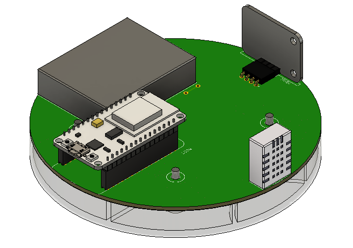

# Air Quality Sensor

## Overview

This is air quality sensor that can measure PM1.0, PM2.5, PM10, tVOC and eCO2, but also temperature and humidity.

This is second version of my project witch has some improvements for example separators in 3d printed casing that prevent heating DHT22 sensor from nodeMCU.

